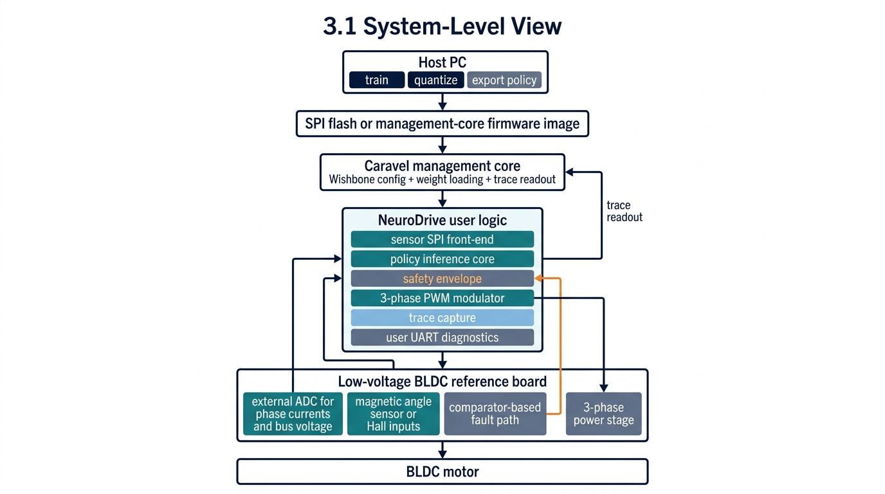
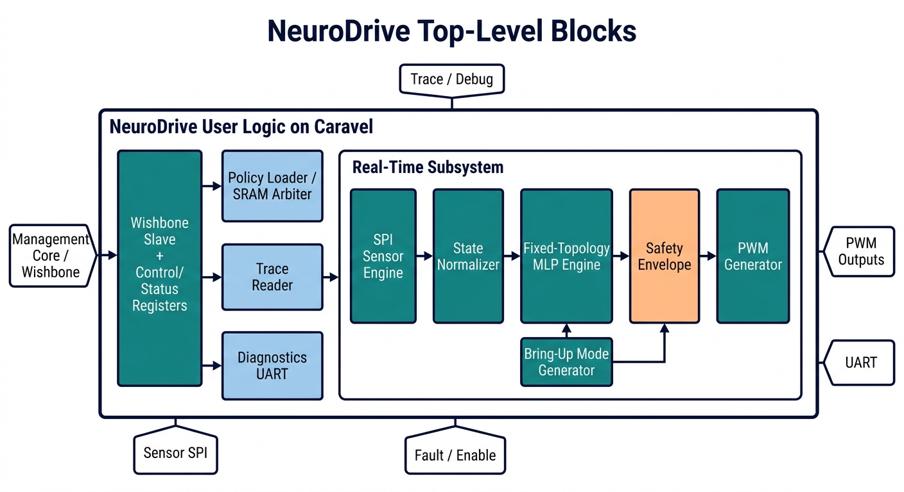
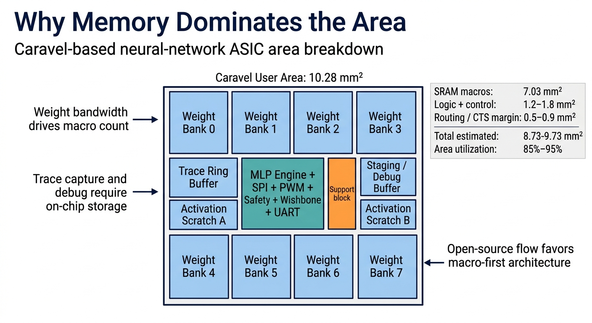
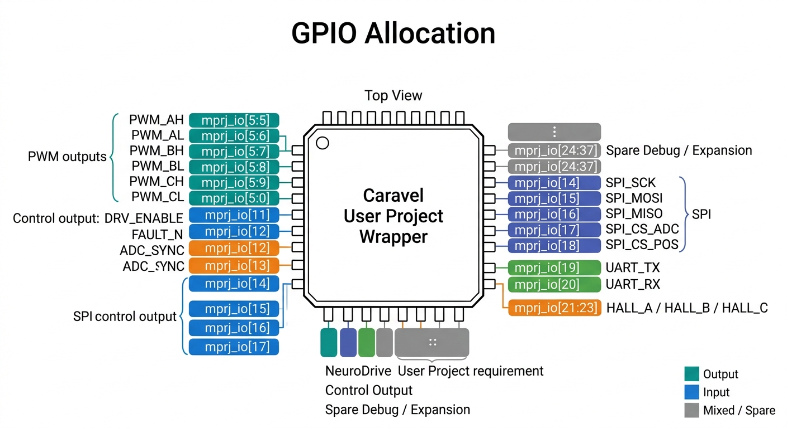
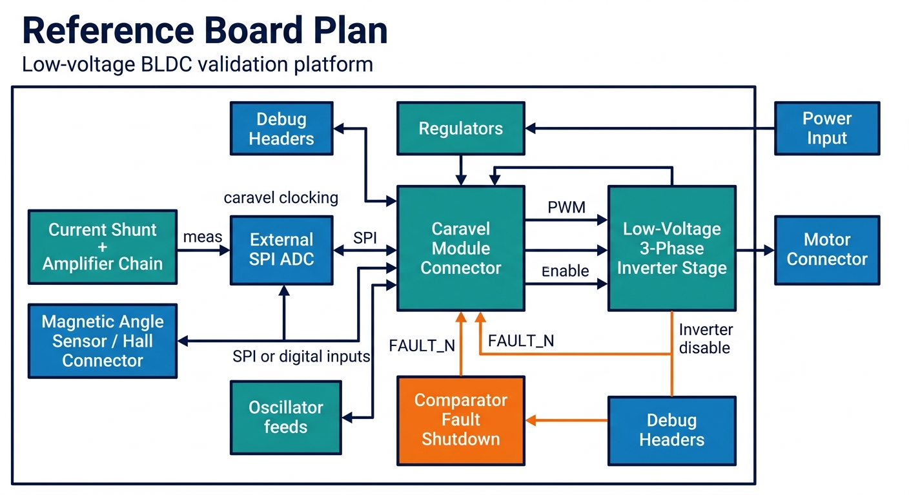

# NeuroDrive: A Tapeout-Realistic RL Policy Inference ASIC for BLDC Motor Control

[](https://opensource.org/licenses/Apache-2.0)
[](https://chipfoundry.io)
[](#)

> ChipFoundry Reference Application Design Contest Proposal
> March 26, 2026


## Problem Statement

FOC is the industry standard for BLDC motor control: reliable, efficient, and runs on $2 microcontrollers at 20+ kHz. But FOC is model-based and hand-tuned — it requires per-motor PI gain calibration, degrades when motor parameters drift with temperature or wear, and cannot adapt to changing loads without re-commissioning. RL eliminates these limitations. Hardware-validated studies show RL controllers matching or exceeding FOC in tracking accuracy while delivering 50% faster settling times, zero overshoot, and robustness to parameter variations without retuning. Meta-RL has generalized single policies across motor power classes from watts to kilowatts. The problem is deployment: RL policies train in Python on GPUs but have no dedicated hardware path to execute at deterministic motor-control rates. Researchers rely on general-purpose MCUs with variable inference latency or FPGA setups requiring HDL expertise orthogonal to the RL community. Physical AI in robotics — legged locomotion, dexterous manipulation, adaptive actuators — demands actuator-level intelligence executing learned policies in real time with hardware-enforced safety. A purpose-built, open-source RL inference chip for BLDC control would bridge the simulation-to-hardware gap and give the robotics community a standardized platform to move RL motor control from laboratory curiosity to deployable technology.

---

## Table of Contents

- [1. Executive Summary](#1-executive-summary)
- [2. Rev A Project Scope](#2-rev-a-project-scope)
- [3. Updated System Architecture](#3-updated-system-architecture)
- [4. Digital Architecture](#4-digital-architecture)
- [5. Memory and Area Plan](#5-memory-and-area-plan)
- [6. Caravel Integration Plan](#6-caravel-integration-plan)
- [7. Reference Board Plan](#7-reference-board-plan)
- [8. Verification Strategy](#8-verification-strategy)
- [9. Implementation Schedule](#9-implementation-schedule)
- [10. Marketplace IP Plan](#10-marketplace-ip-plan)
- [11. Cost Estimate](#11-cost-estimate)
- [12. Feasibility Basis](#12-feasibility-basis)
- [13. Risks and Mitigations](#13-risks-and-mitigations)
- [14. References](#14-references)

---

## 1. Executive Summary

**NeuroDrive** is a digital policy-inference ASIC for low-voltage BLDC motor control research on the Caravel SKY130 platform. The chip targets a realistic and reproducible reference design:

- a fixed-topology INT8 MLP accelerator for a pre-trained RL policy,
- deterministic sensor acquisition from external ADC and rotor-angle devices,
- a hard real-time 3-phase PWM modulator with complementary outputs,
- a hardware safety envelope that can override the policy immediately,
- and enough on-chip memory and trace capture to use most of the Caravel user area in a way that is technically justified.

The design is intentionally **memory-dominated**. The Caravel user project wrapper exposes about **2.920 mm x 3.520 mm = 10.28 mm2** of area, with roughly **8.7 to 9.7 mm2** targeted for logic and SRAM macros using the ChipFoundry marketplace memory options for weight bandwidth, trace capture, and bring-up buffers.

### Rev A Specifications

| Parameter | Rev A Target |
|---|---|
| Process | SKY130 |
| Platform | Caravel user area, 2.920 mm x 3.520 mm |
| User logic style | Digital only |
| Policy topology | Fixed MLP, `12 -> 90 x 10 hidden layers -> 3`, INT8 |
| MAC architecture | 32-lane output-parallel INT8 MAC array |
| Weight bandwidth | 256 bits/cycle via 8 interleaved 32-bit SRAM macros |
| Nominal clock target | 25 MHz |
| Stretch clock target | 40 MHz if timing allows |
| PWM carrier | 20 kHz |
| Policy update rate | 5 kHz baseline, 10 kHz stretch |
| Outputs | 6 complementary PWM outputs generated from 3 commanded duties |
| Sensor interface | Shared SPI to external ADC and angle sensor, optional Hall fallback |
| Safety | Async fault kill, watchdog, stale-sensor detect, duty clamp, slew limiter |
| Bring-up modes | Direct duty mode and open-loop electrical-angle sweep mode |
| Marketplace IP | Commercial SRAM macros, `CF_UART` |
| Marketplace IP cost | $2,500 per project for all SRAM instances |

### Rev A Positioning

This project is a **reference application**, not a claim that RL will immediately outperform tuned FOC on every motor. The value is a complete open-source path from:

`offline RL training -> fixed-point export -> deterministic silicon inference -> safe low-voltage BLDC bench setup`

Priority is placed on maximizing policy size within the Caravel area while preserving a credible open-source implementation path, rather than on maximizing control-loop bandwidth.

---

## 2. Rev A Project Scope

### 2.1 In Scope

- Caravel-integrated user project with fixed-topology policy inference
- Deterministic sensor acquisition from external digital parts
- 3-phase complementary PWM generation with dead-time and synchronous duty updates
- Hardware safety interlocks and fault reporting
- Firmware for configuration, policy loading, trace readout, and safe start/stop
- 4-layer reference board design for a low-voltage BLDC test setup
- Mechanical fixture and assembly notes for post-silicon validation
- Full RTL, GLS, STA constraints, OpenLane hardening, and precheck package
- Open-source training/export scripts for the frozen Rev A policy format

### 2.2 Explicitly Out of Scope for Rev A

- On-chip RL training
- Sensorless startup
- Full FOC implementation as a second controller on silicon
- Runtime weight updates while the motor is spinning
- High-voltage or high-current industrial inverter hardware
- Safety certification
- Claiming a pre-silicon hardware motor demo before chips return

---

## 3. Updated System Architecture

### 3.1 System-Level View



```
Host PC
  |
  |  train / quantize / export policy
  v
SPI flash or management-core firmware image
  |
  v
Caravel management core -> Wishbone config + weight loading + trace readout
  |
  v
NeuroDrive user logic
  |- sensor SPI front-end
  |- policy inference core
  |- safety envelope
  |- 3-phase PWM modulator
  |- trace capture
  `- user UART diagnostics
  |
  v
Low-voltage BLDC reference board
  |- external ADC for phase currents and bus voltage
  |- magnetic angle sensor or Hall inputs
  |- comparator-based fault path
  `- 3-phase power stage
```

### 3.2 Real-Time Control Partition

The management core is **not** in the control loop. It only:

- loads policy weights,
- programs limits and timing registers,
- enables or disables control,
- services faults,
- and reads trace memory after a run.

The user logic performs:

- SPI sensor transactions,
- state-vector assembly,
- policy inference,
- PWM update timing,
- and fault handling.

Deterministic motor-control timing on Caravel requires this partitioning, with the management core excluded from the real-time loop.

### 3.3 Control Abstraction

The policy does **not** command transistor gates directly. Rev A uses this signal chain:

`policy output[2:0] -> clamp + slew limit -> 3 signed phase duty commands -> complementary PWM generator -> 6 gate-driver inputs`

Power-stage safety remains in deterministic hardware.

### 3.4 Fixed State and Action Format

Rev A freezes a single policy interface:

- **12-element state vector**:
  - `i_a`, `i_b`, `i_c`
  - `v_bus`
  - `sin(theta_e)`, `cos(theta_e)`
  - `omega_est`
  - `reference`
  - `duty_a_prev`, `duty_b_prev`, `duty_c_prev`
  - `derate_or_temperature_margin`

- **3-element action vector**:
  - `duty_a_cmd`
  - `duty_b_cmd`
  - `duty_c_cmd`

The action outputs are signed fixed-point quantities interpreted by the hardware modulator.

---

## 4. Digital Architecture

### 4.1 Top-Level Blocks



```
Wishbone slave + control/status registers
        |
        +-- policy loader / SRAM arbiter
        +-- trace reader
        +-- diagnostics UART
        |
        +-- real-time subsystem
             |- SPI sensor engine
             |- state normalizer
             |- fixed-topology MLP engine
             |- safety envelope
             |- PWM generator
             `- bring-up mode generator
```

### 4.2 Policy Inference Engine

Rev A uses a fixed MLP:

- `12 -> 90 -> 90 -> 90 -> 90 -> 90 -> 90 -> 90 -> 90 -> 90 -> 90 -> 3`
- INT8 weights and activations
- ReLU in hidden layers
- linear output layer

This network contains:

- **74,250 weights**
- **903 biases**
- **75,153 INT8 parameters total**

At one byte per parameter, the policy image is about **75 KB**, which fits inside the planned **128 KB** interleaved weight store with margin for headers and quantization metadata.

The accelerator uses a **32-lane output-parallel** datapath:

- each cycle, one input activation is broadcast,
- 32 signed weights are fetched in parallel,
- 32 accumulators update 32 output neurons at once.

This organization keeps activation-memory bandwidth modest while making weight bandwidth the dominant requirement. That directly motivates the eight-bank SRAM plan in Section 5.

### 4.3 Neural-Network Sizing Feasibility

A central sizing question is whether a **10 hidden-layer, 90 neuron per layer** network is realistic in the available Caravel area.

**Area conclusion**: yes.

- The policy itself needs about **75 KB** of INT8 parameter storage.
- The planned weight memory provides **128 KB**.
- The arithmetic core area is not the limiter; the limiter is weight bandwidth and update rate.

**Throughput conclusion**: also yes, but only with the wider banked datapath selected here.

For the fixed `12 -> 90 x 10 hidden -> 3` network:

| Item | Value |
|---|---|
| MAC cycles | `12 x ceil(90/32) + 9 x 90 x ceil(90/32) + 90 x ceil(3/32)` = `2556` |
| Control overhead | ~150 to 200 cycles |
| **Total cycles** | **~2720** |
| Inference time at 25 MHz | **~109 us** |
| Inference time at 40 MHz | **~68 us** |

This supports the following proposal targets:

- **5 kHz policy rate** as the nominal first-silicon objective at 25 MHz
- **10 kHz policy rate** as the stretch objective at 40 MHz

Under the stated clock and bus assumptions, larger networks would require either a wider weight bus or a more aggressive clock-only assumption.

### 4.4 Why This Network Size Is Credible

Previous Tiny Tapeout neural-network projects show that the compute itself is not the limiting factor:

- `Neural Network dinamic` tapes out a reusable-neuron FSM-based NN that serializes layer execution at **66 MHz**.
- `Reward implemented Spiking Neural Network` builds an **8-layer** network with weights loaded from memory.
- Greg Chadwick's `Tiny Neural Network Accelerator` tapes out a toy accelerator with multiple floating-point units and a full external model/DV flow, showing that dedicated NN datapaths are practical when the interface is fixed.

Those examples are much smaller than the Caravel user area. The lesson carried into NeuroDrive is that **memory organization and timing budget matter more than raw multiplier count**.

### 4.5 Bring-Up and Safe Modes

Rev A adds two non-NN modes:

1. **Direct Duty Mode**
   - software writes the three phase duties directly,
   - used for board bring-up and power-stage validation.

2. **Open-Loop Angle Sweep Mode**
   - hardware emits a slow rotating electrical angle and modulation ramp,
   - used to verify encoder polarity, phase ordering, and inverter wiring.

These two modes make post-silicon bring-up materially more realistic.

### 4.6 Safety Envelope

The safety subsystem is entirely outside the neural network.

It enforces:

- asynchronous `FAULT_N` kill path from the external comparator,
- synchronized fault logging into status registers,
- watchdog timeout on missing policy completions,
- stale-sensor detection,
- duty clamp and minimum-off enforcement,
- duty slew-rate limiting,
- startup interlock,
- and forced neutral output on fault or invalid-policy state.

The external fault signal is intended to disable both the **ASIC PWM path** and the **power-stage enable** path. The chip is therefore not the single point of safety.

### 4.7 Policy Image Format

The weight image loaded by firmware includes:

- magic/version field,
- topology ID,
- quantization scale metadata,
- per-policy clamps,
- CRC32 of the payload,
- and the interleaved weight/bias payload.

Weights are loaded only while PWM is disabled. The hardware refuses to arm motor control until the image passes header and CRC checks.

---

## 5. Memory and Area Plan

### 5.1 Why Memory Dominates the Area

Most of the Caravel project area is allocated intentionally because:

- the NN engine needs **bandwidth**, not just capacity,
- the contest asks for a complete reference design, so traceability and diagnostics matter,
- and a large mostly-empty wrapper would look less credible than a well-justified, memory-centered architecture.

### 5.2 Selected Memory Architecture



| Macro Use | Instance Count | Size Each | Total Capacity | Area Each | Total Area |
|---|---|---|---|---|---|
| Interleaved weight banks | 8 | 16 KB | 128 KB | 0.67 mm2 | 5.36 mm2 |
| Trace ring buffer | 1 | 16 KB | 16 KB | 0.67 mm2 | 0.67 mm2 |
| Staging / metadata / debug capture | 1 | 16 KB | 16 KB | 0.67 mm2 | 0.67 mm2 |
| Activation scratch A | 1 | 4 KB | 4 KB | 0.165 mm2 | 0.165 mm2 |
| Activation scratch B | 1 | 4 KB | 4 KB | 0.165 mm2 | 0.165 mm2 |
| **Total memory** |  |  | **168 KB** |  | **7.03 mm2** |

### 5.3 Why Eight 32-Bit Weight Banks Are the Right Choice

Each cycle, the 32-lane MAC array needs **32 signed 8-bit weights**. Eight 32-bit SRAM banks provide:

- 8 words/cycle,
- 32 bytes/cycle,
- 256 bits/cycle total.

Eight 32-bit banks are the minimum clean architecture for the chosen datapath.

### 5.4 Estimated Total Area

| Block | Estimated Area |
|---|---|
| SRAM macros | 7.03 mm2 |
| MLP engine + normalization + safety + PWM + SPI + Wishbone + UART | 1.2 to 1.8 mm2 |
| Routing, CTS, control logic margin | 0.5 to 0.9 mm2 |
| **Total** | **8.73 to 9.73 mm2** |

Estimated utilization is roughly **85% to 95%** of the available Caravel user area, leaving a narrow but usable routing margin.

### 5.5 Floorplan Intent

- weight SRAM banks placed symmetrically around the MLP core to minimize the 256-bit bus routing,
- activation scratch adjacent to the core for ping-pong layer buffering,
- trace and staging SRAM placed closer to the Wishbone and UART side,
- PWM and safety placed near the GPIO edge,
- SPI and sensor front-end placed near the sensor I/O cluster.

This floorplan is compatible with a macro-first hardening plan in OpenLane.

---

## 6. Caravel Integration Plan

### 6.1 Interfaces Used

- **Wishbone slave**
  - configuration,
  - policy loading,
  - trace readout,
  - status and fault reporting.

- **Logic analyzer**
  - bring-up visibility,
  - test overrides,
  - internal state observation during DV.

- **GPIO**
  - PWM outputs,
  - shared SPI,
  - diagnostics UART,
  - fault and enable pins,
  - optional Hall inputs.

- **User IRQ**
  - `irq[0]`: latched fault,
  - `irq[1]`: trace buffer full,
  - `irq[2]`: policy loaded / heartbeat.

### 6.2 GPIO Allocation



| GPIO | Direction | Function |
|---|---|---|
| `mprj_io[5:10]` | Output | `PWM_AH`, `PWM_AL`, `PWM_BH`, `PWM_BL`, `PWM_CH`, `PWM_CL` |
| `mprj_io[11]` | Output | `DRV_ENABLE` |
| `mprj_io[12]` | Input | `FAULT_N` |
| `mprj_io[13]` | Output | `ADC_SYNC` |
| `mprj_io[14]` | Output | `SPI_SCK` |
| `mprj_io[15]` | Output | `SPI_MOSI` |
| `mprj_io[16]` | Input | `SPI_MISO` |
| `mprj_io[17]` | Output | `SPI_CS_ADC` |
| `mprj_io[18]` | Output | `SPI_CS_POS` |
| `mprj_io[19]` | Output | `UART_TX` |
| `mprj_io[20]` | Input | `UART_RX` |
| `mprj_io[21:23]` | Input | Optional `HALL_A/B/C` or spare digital inputs |
| `mprj_io[24:37]` | Mixed | Spare debug and expansion pins |

This allocation stays within the normal Caravel model where GPIO `5:37` are the user-configurable pins.

### 6.3 Clocking

Rev A baseline:

- one synchronous user-logic domain,
- target timing closure at **25 MHz**,
- no mandatory PLL dependency,
- and a stretch bring-up point at **40 MHz**.

The baseline implementation remains conservative while still allowing a higher-rate experiment if timing and bring-up allow it.

---

## 7. Reference Board Plan

### 7.1 Board Objective

The board is not a production inverter. It is a **low-voltage post-silicon validation platform** for:

- current sensing,
- rotor position sensing,
- PWM generation,
- fault behavior,
- and closed-loop policy evaluation on a small BLDC motor.

### 7.2 Board Design Choices

| Design choice | Rationale |
|---|---|
| 4-layer board | cleaner return paths and lower switching-noise risk |
| low-voltage, low-current power stage | aligned with a research board and the contest timeline |
| bench-friendly BOM | keeps post-silicon validation accessible |
| explicit comparator fault path | provides a hard shutdown path outside the NN |

### 7.3 Planned Board Contents




- Caravel module connector
- low-voltage 3-phase inverter stage
- current shunt and amplifier chain
- external SPI ADC
- SPI magnetic angle sensor or Hall connector
- hardware comparator for fault shutdown
- regulators, oscillator, debug headers, motor and power connectors

### 7.4 Board-Level Safety

The board includes a comparator-driven shutdown path that:

- feeds `FAULT_N` into the ASIC for logging,
- and independently disables the motor-driver enable path.

The digital controller is therefore not the only safety barrier.

---

## 8. Verification Strategy

The contest explicitly requires RTL tests, GLS, STA constraints, and passing precheck. Rev A therefore prioritizes verification over optional features.

### 8.1 Block-Level Verification

- MLP engine against a Python fixed-point golden model
- weight-bank interleaving and address generation
- activation scratch ping-pong operation
- PWM timing, dead-time, and synchronized duty updates
- safety envelope fault injection
- SPI master transactions with ADC and angle-sensor models
- policy image header and CRC checking

### 8.2 Integration Verification

- sensor transaction -> state build -> inference -> PWM update
- fault during inference
- stale-sensor timeout
- policy load / arm / disarm sequences
- bring-up modes without the NN enabled

### 8.3 Gate-Level and Signoff

- one short GLS smoke test for each major mode
- SDF-backannotated motor-control integration smoke test
- STA with the contest-required SDC
- `cf precheck` and platform tapeout checks

### 8.4 Verification Scope

The verification plan does **not** claim full analog motor-plant proof. Instead it provides:

- digital correctness,
- timing signoff,
- safety-sequence coverage,
- and a reproducible software golden model.

This verification scope matches the contest timeline.

---

## 9. Implementation Schedule

The challenge sets:

- proposal deadline: **March 25, 2026**
- final tapeout-ready submission: **April 30, 2026**
- shuttle tapeout: **May 13, 2026**
- silicon return and assembly: **October / November 2026**

That means the tapeout-ready phase is about **35 days** long. The plan must be narrow.

### Phase 0: Scope Freeze and IP Setup

**March 26 - March 30**

- freeze topology, pinout, and policy image format
- install marketplace IP and create wrappers
- finalize floorplan assumptions and memory banking
- write golden-model format and test vectors

### Phase 1: Core RTL and Unit Tests

**March 31 - April 8**

- MLP engine
- SRAM bank wrappers and arbiter
- activation scratch and state normalizer
- PWM and safety blocks
- SPI front-end
- unit cocotb regressions

### Phase 2: Integration and Firmware Skeleton

**April 9 - April 18**

- Caravel wrapper integration
- Wishbone register map
- policy loader firmware
- trace capture path
- diagnostics UART integration
- integration regression

### Phase 3: Hardening and Signoff Closure

**April 19 - April 25**

- macro placement
- OpenLane hardening
- timing closure
- DRC and LVS fix iteration
- GLS smoke tests

### Phase 4: Submission Package

**April 26 - April 30**

- `cf precheck`
- board schematic and layout package
- docs and assembly notes
- final BOM
- AI session logs and release cleanup

### What Is Deliberately Deferred Until Chips Return

- live motor-spin demonstration on fabricated silicon
- board assembly results
- post-silicon controller tuning across multiple motors

The schedule remains consistent with the contest timeline and does not imply silicon availability before April 30, 2026.

---

## 10. Marketplace IP Plan

### 10.1 Selected IP

| IP | Use | Cost | Selection Rationale |
|---|---|---|---|
| Commercial SRAM macros (`1024x32`, `4096x32`, `8192x32`) | weight banks, activation scratch, trace buffers | $2,500 per project | Required for realistic density and bandwidth |
| `CF_UART` | diagnostics and trace dump interface | $0 | Reduces schedule risk versus writing another UART block |

### 10.2 Evaluated but Not Selected for the Main Path

| IP | Reason not selected as primary solution |
|---|---|
| `CF_TMR32` | good standalone timer/PWM IP, but synchronized 3-phase complementary motor PWM is cleaner to verify as one custom block |
| `OL-DFFRAM` for bulk weights | free but too area-inefficient for the target memory footprint |

### 10.3 Why Marketplace SRAM Is Justified

Without the commercial SRAM option, Rev A would have to shrink to a much smaller network and leave a large fraction of the Caravel area unused. In the sponsored path, the proposal assumes organizer coverage of the marketplace IP cost, making the SRAM option the correct choice for:

- a more credible memory system,
- higher confidence physical design,
- and a better use of the available silicon area.

---

## 11. Cost Estimate

### 11.1 EDA and Core Tooling

| Item | Cost |
|---|---|
| Open-source RTL, PnR, STA, verification, and board tools | $0 |

### 11.2 Marketplace IP

| Item | Cost | Notes |
|---|---|---|
| Commercial SRAM macros | $2,500 | one project fee, unlimited instances per ChipFoundry page |
| `CF_UART` | $0 | free catalog IP |

### 11.3 Reference Board and Bench Hardware

These are intentionally stated as realistic low-volume estimates, not inflated industrial BOM claims.

| Item | Estimated Cost |
|---|---|
| Low-voltage 4-layer BLDC reference board, assembled | $45 to $70 |
| Small BLDC motor | $15 to $25 |
| Lab supply / adapter / debug accessories | $25 to $40 |
| Mechanical fixture and printed parts | $5 to $10 |
| **Post-silicon bench total** | **$90 to $145** |

### 11.4 Contest-Sponsored Path

| Item | Cost to Project |
|---|---|
| Fabrication and packaging | covered by contest |
| Initial prototype PCBA support | covered by contest |
| Mechanical support | covered by contest |
| Commercial SRAM IP | covered by organizers in the sponsored path |
| Miscellaneous bench hardware | ~$90 to $145 |

The cost plan separates:

- silicon and sponsored contest costs,
- marketplace IP cost,
- and the actual post-silicon bench bring-up cost.

---

## 12. Feasibility Basis

This proposal is based on practical lessons from previous Tiny Tapeout projects and from the Caravel contest rules.

### 12.1 Lessons Taken from Tiny Tapeout

1. **Deep networks are feasible when the datapath is reused over time**

   `Neural Network dinamic` and `Reward implemented Spiking Neural Network` both rely on sequential reuse of a small amount of hardware across multiple layers. NeuroDrive follows that same principle at a larger scale.

2. **NN accelerators are practical when the on-chip interface is fixed**

   Greg Chadwick's Tiny Neural Network Accelerator keeps a fixed operation interface and pushes model software, verification collateral, and utilities off-chip. NeuroDrive adopts the same split.

3. **Arithmetic density is not the dominant issue on Caravel**

   The Tiny Tapeout examples above fit on tiles far smaller than the Caravel user area. For NeuroDrive, the limiting factors are memory bandwidth, SRAM integration, and timing closure, not whether INT8 MAC lanes can fit.

4. **Deterministic peripherals should remain outside the neural network**

   Projects such as `spi_pwm` show that simple, register-driven PWM hardware is credible in open-source flows. NeuroDrive keeps PWM, fault handling, and bring-up modes deterministic and outside the policy core.

### 12.2 Lessons Taken from the ChipFoundry Contest Rules

The challenge judges:

- technical innovation,
- verification coverage,
- documentation quality,
- and feasibility/cost.

That means the winning plan is not the broadest plan. It is the plan with the strongest ratio of:

`useful novelty / verification risk`

The resulting architecture prioritizes a larger but still defensible network, fixed interfaces, and a macro-first physical plan.

---

## 13. Risks and Mitigations

| Risk | Impact | Mitigation |
|---|---|---|
| Large macro count makes top-level floorplanning harder | High | freeze macro plan early and harden around a memory-first floorplan |
| 40 MHz may not close after layout | Medium | baseline the project at 25 MHz and 5 kHz policy rate |
| Motor bring-up can fail for board-level reasons unrelated to the NN | High | add direct-duty mode and open-loop sweep mode |
| Weight image corruption causes unsafe startup | Medium | CRC-protected policy format and arm-after-validate sequence |
| Sensor interface bugs appear late | Medium | emulate ADC and encoder in cocotb from the start |
| Full physical board assembly may slip beyond tapeout deadline | Low | board design files are in scope; physical validation is post-silicon by contest timeline |

---

## 14. References

### Contest and Platform

1. ChipFoundry Reference Application Design Contest  
   https://chipfoundry.io/challenges/application

2. ChipFoundry Commercial SRAM page  
   https://chipfoundry.io/commercial-sram

3. ChipFoundry IP Catalog  
   https://platform.chipfoundry.io/ip-catalog

4. Local Caravel wrapper area and integration template  
   `openlane/user_project_wrapper/config.json`  
   `verilog/rtl/user_project_wrapper.v`

### Tiny Tapeout precedents

5. Tiny Tapeout chips index  
   https://tinytapeout.com/chips/

6. QTCore-A1  
   https://tinytapeout.com/chips/tt03/kiwih_tt_top

7. RTL Locked QTCore-A1  
   https://tinytapeout.com/runs/tt03/072

8. Tiny Neural Network Accelerator  
   https://tinytapeout.com/chips/ttihp25a/tt_um_gregac_tiny_nn

9. Neural Network dinamic  
   https://tinytapeout.com/runs/tt07/tt_um_neural_network

10. Reward implemented Spiking Neural Network  
    https://www.tinytapeout.com/chips/ttsky25a/tt_um_snn

11. spi_pwm  
    https://tinytapeout.com/chips/ttihp25a/tt_um_spi_pwm_djuara

### License

This project is licensed under the [Apache License 2.0](https://www.apache.org/licenses/LICENSE-2.0).
